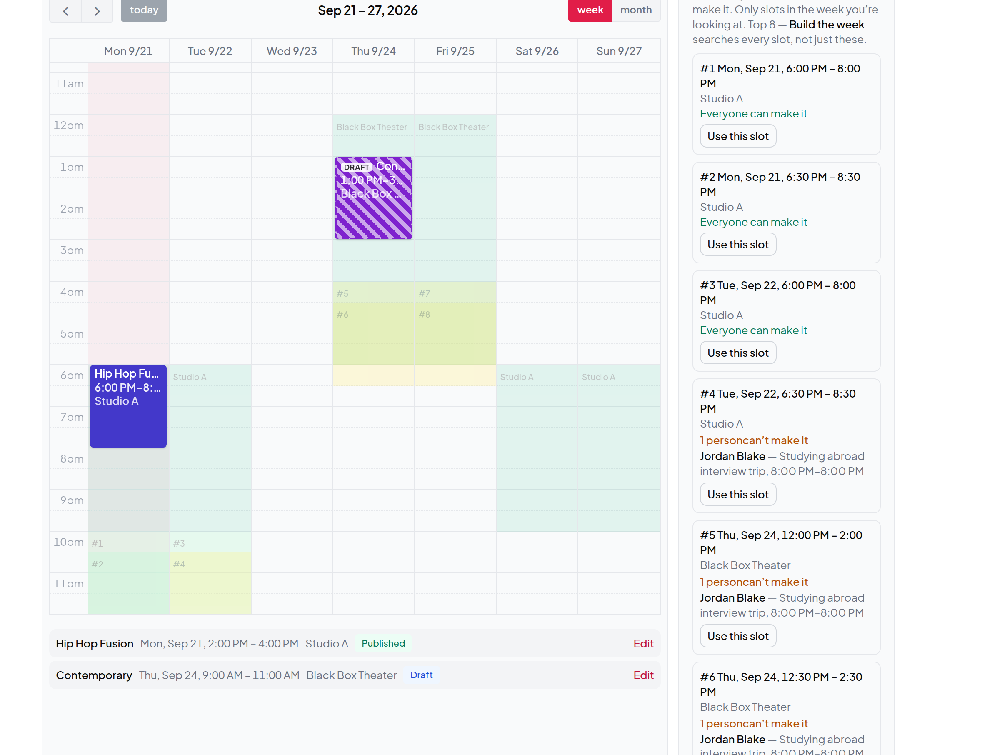
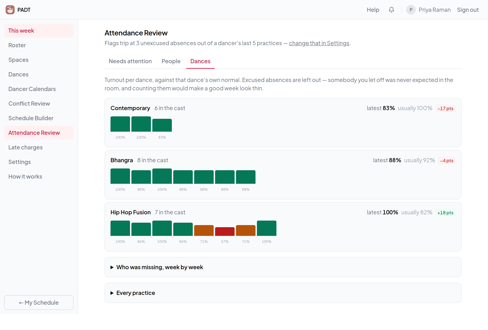
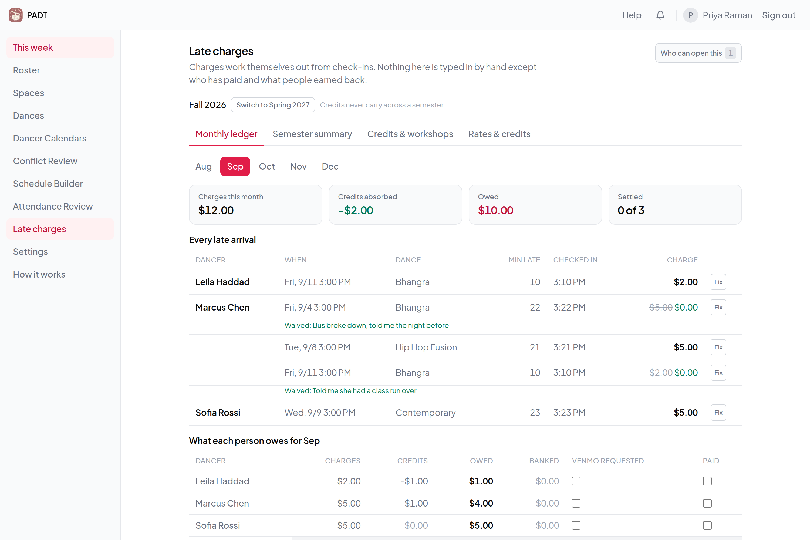
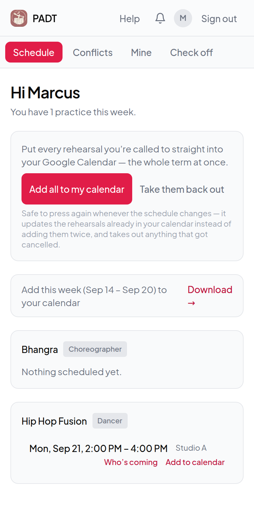

<div align="center">


# PADT Calendar

**Rehearsal scheduling for a 40-person dance company.**

Collects everyone's conflicts, solves the whole week around them in one press,
and runs attendance, notifications and dues off the same record.


</div>

---

Penn Asian Dance Troupe ran on a group chat and a spreadsheet. Every week the
artistic director hunted for a two-hour window a whole cast could make, across
several rooms and a term's worth of classes, jobs and interviews — then did it
again for the next piece, by which point the good slots were gone.

This replaces that with one button. It is in production at
[padtcal.vercel.app](https://padtcal.vercel.app), running the season for a
troupe of about forty.

<table>
<tr>
<td width="50%"></td>
<td width="50%"></td>
</tr>
<tr>
<td></td>
<td align="center"></td>
</tr>
</table>

## The scheduler

The interesting problem. Placing dances one at a time means whichever dance you
open first takes the best slot, and a dance that only ever had two workable
times finds both gone. **Build the week** solves them together.

A week is judged on three things, **lexicographically** — each one settled
before the next is consulted, with no exchange rate between them:

1. **How many dances got a time.** Never traded away.
2. **Who can't be there.** Weighted: choreographers count for more, and so does
   anyone the schedule has already made miss out — with an escalating penalty
   for a run of misses, so the same person is never quietly sacrificed a fourth
   week running.
3. **Dead minutes in the booked rooms.** A 30-minute hole is a room the club is
   paying for that nobody can use.

The search is regret-first insertion, then displacement chains up to three
deep, then destroy-and-repair, restarted from randomised starts inside a
10-second budget. Two properties it holds on to:

- **No dance is ever improved below half its cast.** A rehearsal with a third
  of the room isn't a third of a rehearsal. Coverage still overrides — a dance
  that would otherwise go unscheduled ignores the floor.
- **Deterministic.** The first attempt is noise-free and a rival has to be
  *strictly* better to replace it, so more time can match or beat the plain
  answer but never undercut it. Randomness is seeded from the input: the same
  week always solves the same way.

## What it does

**Dancers** sync a term of conflicts from one shared Google Calendar in a tap,
check in when a rehearsal starts, and see their own attendance and charges.
Installable to a phone home screen, with push notifications when the schedule
is posted, when a practice moves, and 15 minutes before each one.

**Choreographers** see who's coming before it happens — expected, excused, and
coming late with the time each person agreed — watch check-ins land live,
record that a rehearsal actually started late so nobody is penalised for it,
and sign off the recap.

**The artistic director** gets a weekly checklist, conflict review, room
availability with Google Calendar import, the week builder, one-press publish
that writes every practice to the team calendar and sends one message per
person, attendance review with chronic-absence flags, and a late-charge ledger
with dated fee schedules and a spreadsheet export.

## Engineering notes

| | |
| --- | --- |
| **Time** | One Eastern-time module every date passes through. The server runs UTC, so a stray `getHours()` silently moves a 7pm rehearsal — the tests pin `TZ=UTC` to keep that honest. |
| **Money** | Integer cents throughout; dollars exist only at the display and export edges. Fee schedules are effective-dated, so raising the rates in October leaves September priced as people were told. |
| **Notifications** | Deduplicated against the notification rows themselves rather than against timing, so the cron endpoint is safe to call as often as you like. Publishing is the only thing that notifies; editing a published practice stages the change. |
| **Calendar** | Two-way with Google: conflicts import from a shared calendar, published practices are written out and updated in place when they move. |
| **Tests** | 319 assertions across 7 suites — plain `tsx` scripts, no framework — covering slot scoring, the solver's tiers and floors, lateness maths against agreed arrivals, and the dues waterfall. |

~30k lines of TypeScript, 30 Prisma models, 20 migrations.

## Stack

Next.js 16 (App Router, server actions) · React 19 · TypeScript · Tailwind 4 ·
Prisma 7 on PostgreSQL · Auth.js with Google OAuth · Web Push · Google Calendar
API · FullCalendar · SheetJS · deployed on Vercel and Neon.

<details>
<summary><b>Run it locally</b></summary>

No Google OAuth setup needed — there's a development-only sign-in that lets you
be anyone on the roster.

**1.** Install [Node.js](https://nodejs.org) (LTS).

**2.** Get a free Postgres database at [neon.com](https://neon.com) and copy the
connection string. Two minutes, no card.

**3.** Create `.env` in the project folder:

```
DATABASE_URL="your-neon-connection-string"
NEXTAUTH_URL="http://localhost:3000"
NEXTAUTH_SECRET="any-random-string-for-local"
ALLOW_DEV_LOGIN="true"
```

**4.** Run these one at a time:

```bash
npm install
npx prisma migrate deploy   # create the tables
npm run seed:demo           # fill them with a realistic season
npm run dev
```

**5.** Open <http://localhost:3000> and pick a name under "Local development
only":

| Sign in as | To see |
| --- | --- |
| **Priya Raman** | The AD — Schedule Builder, Attendance Review, Late charges |
| **Aisha Okonkwo** | A choreographer with a practice waiting to be signed off |
| **Diego Alvarez** | A dancer with conflicts already logged |

The seed leaves a Contemporary practice in draft, three conflicts unreviewed
and each dance's most recent practice unsubmitted, so every queue opens with
something in it.

> Dev login needs `ALLOW_DEV_LOGIN=true` **and** a development build. `NODE_ENV`
> is fixed to `production` in any real deployment, so it cannot be switched on
> for a live site even by mistake.

</details>

<details>
<summary><b>Deploy it</b></summary>

**[DEPLOYMENT.md](DEPLOYMENT.md)** is the step-by-step walkthrough. Beyond the
local setup you'll need:

- **Google Cloud OAuth client** for real sign-in — add
  `<your-url>/api/auth/callback/google` as a redirect URI and enable the Google
  Calendar API. Set `GOOGLE_CLIENT_ID` and `GOOGLE_CLIENT_SECRET`.
- **`INITIAL_ADMIN_EMAIL`** — whoever signs in with it becomes the first admin.
- **`VAPID_PUBLIC_KEY` / `VAPID_PRIVATE_KEY` / `VAPID_SUBJECT`** — push is the
  only way the app reaches anyone who isn't looking at it. Generate with
  `npx web-push generate-vapid-keys`. On iPhone these arrive only once the app
  is on the home screen.
- **`CRON_SECRET`** — guards `/api/cron/practice-notifications`, which something
  outside the app calls every few minutes to send the timed reminders.

Leave `ALLOW_DEV_LOGIN` unset. Vercel's free tier is ample for ~40 people.

</details>

## Tests

```bash
npm test
```

